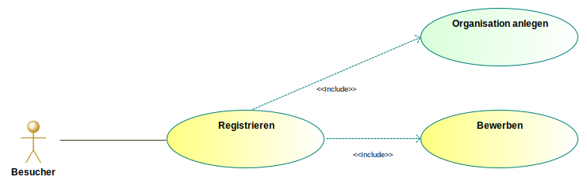
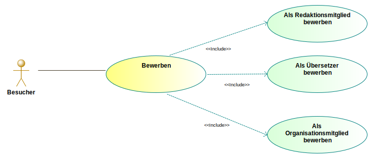
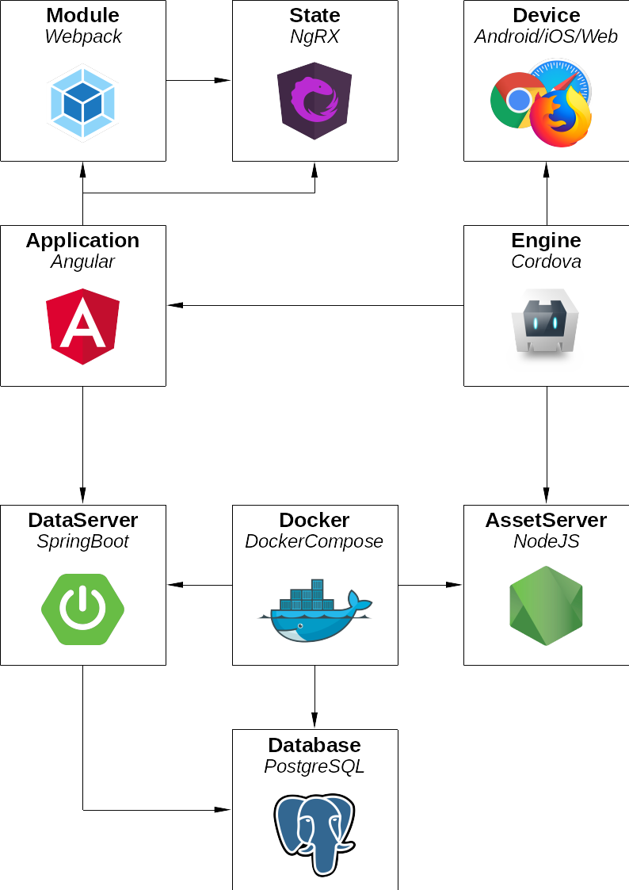
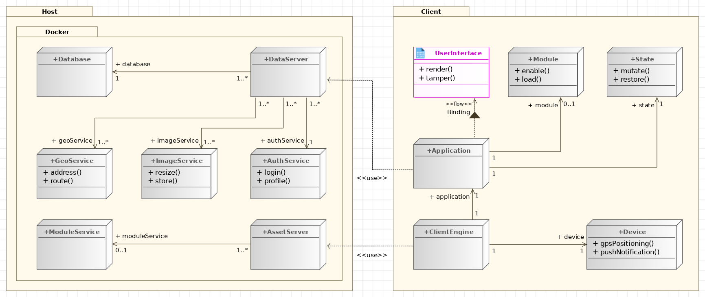
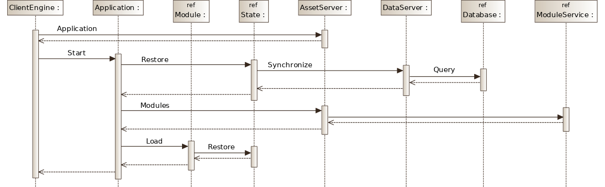
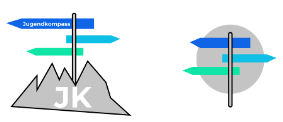
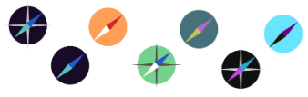
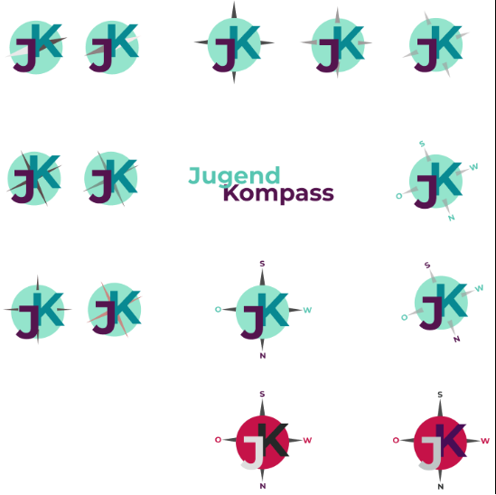

Codeschluss GbR

---

**Konzeption der Jugendkompass Webseite**
---------

- [**Konzeption der Jugendkompass Webseite**](#konzeption-der-jugendkompass-webseite)
- [1 Einführung](#1-einführung)
- [2 Ausgangssituation und Zielsetzung](#2-ausgangssituation-und-zielsetzung)
- [3 Systemüberblick und Benutzergruppen](#3-systemüberblick-und-benutzergruppen)
- [4 Funktionale Anforderungen](#4-funktionale-anforderungen)
- [4.1 Öffentlicher Bereich](#41-öffentlicher-bereich)
- [4.1.1 Beitrag einreichen](#411-beitrag-einreichen)
  - [Bild hochladen](#bild-hochladen)
  - [Video-URL einbetten](#video-url-einbetten)
  - [Als Redaktionsmitglied bewerben](#als-redaktionsmitglied-bewerben)
  - [Text einreichen](#text-einreichen)
- [4.1.2 Beitrag kommentieren](#412-beitrag-kommentieren)
- [4.1.3 Benachrichtungen verwalten](#413-benachrichtungen-verwalten)
  - [Organisation abonnieren](#organisation-abonnieren)
  - [Veranstaltungen abonnieren](#veranstaltungen-abonnieren)
  - [Redaktionsmitglied abonnieren](#redaktionsmitglied-abonnieren)
- [4.1.4 FAQ aufrufen](#414-faq-aufrufen)
- [4.1.5 Feedback senden](#415-feedback-senden)
- [4.1.6 Registrieren](#416-registrieren)
  - [Organisation anlegen](#organisation-anlegen)
- [4.1.7 Bewerben](#417-bewerben)
  - [Als Redaktionsmitglied bewerben](#als-redaktionsmitglied-bewerben-1)
  - [Als Organisationsmitglied bewerben](#als-organisationsmitglied-bewerben)
  - [Als Übersetzer bewerben](#als-übersetzer-bewerben)
- [4.1.8 Suchfunktion nutzen](#418-suchfunktion-nutzen)
  - [Als Freitext suchen](#als-freitext-suchen)
  - [Im Terminkalendar suchen](#im-terminkalendar-suchen)
  - [Auf der Karte suchen](#auf-der-karte-suchen)
  - [Komplexe Suche nutzen](#komplexe-suche-nutzen)
- [4.1.9 Veranstaltung teilnehmen](#419-veranstaltung-teilnehmen)
  - [Veranstaltungsdetails öffnen](#veranstaltungsdetails-öffnen)
  - [Organisationsdetails öffnen](#organisationsdetails-öffnen)
  - [Veranstaltungsort finden](#veranstaltungsort-finden)
  - [Veranstaltung teilen](#veranstaltung-teilen)
  - [Veranstaltungen filtern](#veranstaltungen-filtern)
- [4.1.10 Daten exportieren](#4110-daten-exportieren)
- [4.2 Verwaltungsbereich](#42-verwaltungsbereich)
- [4.2.1 Beitrag verwalten](#421-beitrag-verwalten)
  - [Beitragsübersicht nutzen](#beitragsübersicht-nutzen)
  - [Beiträge filtern](#beiträge-filtern)
  - [Beiträge sortieren](#beiträge-sortieren)
  - [Beiträge zulassen/ablehnen](#beiträge-zulassenablehnen)
  - [Beitrag löschen](#beitrag-löschen)
  - [Beiträge bearbeiten](#beiträge-bearbeiten)
- [4.2.2 Benachrichtigung senden](#422-benachrichtigung-senden)
  - [Neuigkeiten senden](#neuigkeiten-senden)
  - [Inhalte pushen](#inhalte-pushen)
- [4.2.3 Benutzer verwalten](#423-benutzer-verwalten)
  - [Benutzerübersicht nutzen](#benutzerübersicht-nutzen)
  - [Benutzer filtern](#benutzer-filtern)
  - [Benutzer sortieren](#benutzer-sortieren)
  - [Benutzer löschen](#benutzer-löschen)
  - [Rolle verwalten](#rolle-verwalten)
- [4.2.4 Benutzerkonto verwalten](#424-benutzerkonto-verwalten)
  - [Passwort vergessen](#passwort-vergessen)
  - [Eigene Inhalte verwalten](#eigene-inhalte-verwalten)
  - [Profilicon setzen](#profilicon-setzen)
- [4.2.5 CMS nutzen](#425-cms-nutzen)
  - [Seiten verwalten](#seiten-verwalten)
  - [Seite hinzufügen](#seite-hinzufügen)
  - [Seite entfernen](#seite-entfernen)
  - [Seiteninhalt bearbeiten](#seiteninhalt-bearbeiten)
  - [Menü verwalten](#menü-verwalten)
  - [Menüpunkt hinzufügen](#menüpunkt-hinzufügen)
  - [Menüpunkt verändern](#menüpunkt-verändern)
  - [Menüpunkt löschen](#menüpunkt-löschen)
- [4.2.6 Organisation verwalten](#426-organisation-verwalten)
  - [Organisation anlegen](#organisation-anlegen-1)
  - [Organisation bearbeiten](#organisation-bearbeiten)
  - [Organisation löschen](#organisation-löschen)
  - [Organisationsübersicht nutzen](#organisationsübersicht-nutzen)
  - [Organisationübersicht sortieren](#organisationübersicht-sortieren)
  - [Organisationsübersicht filtern](#organisationsübersicht-filtern)
  - [Organisationsdetails öffnen](#organisationsdetails-öffnen-1)
- [4.2.7 Stammdaten verwalten](#427-stammdaten-verwalten)
  - [Einstellungen bearbeiten](#einstellungen-bearbeiten)
- [4.2.8 Adresse verwalten](#428-adresse-verwalten)
  - [Adresse manuell eingeben](#adresse-manuell-eingeben)
  - [Adresse automatisch generieren](#adresse-automatisch-generieren)
  - [Geokoordinaten generieren](#geokoordinaten-generieren)
  - [Adresse bearbeiten](#adresse-bearbeiten)
  - [Adresse löschen](#adresse-löschen)
  - [Adressübersicht nutzen](#adressübersicht-nutzen)
  - [Adresse sortieren](#adresse-sortieren)
  - [Adresse filtern](#adresse-filtern)
- [4.2.9 Termine verwalten](#429-termine-verwalten)
  - [Termine anlegen](#termine-anlegen)
  - [Termine generieren](#termine-generieren)
  - [Termine manuell anlegen](#termine-manuell-anlegen)
  - [Termine bearbeiten](#termine-bearbeiten)
  - [Termine löschen](#termine-löschen)
- [4.2.10 Statistiken abrufen](#4210-statistiken-abrufen)
  - [Seitenklicks abrufen](#seitenklicks-abrufen)
  - [App Downloadzahlen abrufen](#app-downloadzahlen-abrufen)
  - [Suchanfragen Statistiken abrufen](#suchanfragen-statistiken-abrufen)
  - [Klicks der eigenen Inhalte abrufen](#klicks-der-eigenen-inhalte-abrufen)
- [4.2.11 Veranstaltung verwalten](#4211-veranstaltung-verwalten)
  - [Veranstaltung anlegen](#veranstaltung-anlegen)
  - [Veranstaltung bearbeiten](#veranstaltung-bearbeiten)
  - [Termine verwalten](#termine-verwalten)
  - [Adresse verwalten](#adresse-verwalten)
  - [Veranstaltung löschen](#veranstaltung-löschen)
  - [Veranstaltungsübersicht nutzen](#veranstaltungsübersicht-nutzen)
  - [Veranstaltungen sortieren](#veranstaltungen-sortieren)
  - [Veranstaltungsameldungen verwalten](#veranstaltungsameldungen-verwalten)
- [4.2.12 Übersetzungen verwalten](#4212-übersetzungen-verwalten)
  - [Sprache anlegen](#sprache-anlegen)
  - [Übersetzung bearbeiten](#übersetzung-bearbeiten)
  - [Manuelle Übersetzung](#manuelle-übersetzung)
  - [Maschinelle Übersetzung](#maschinelle-übersetzung)
  - [Sprache löschen](#sprache-löschen)
- [5 Technisches Konzept](#5-technisches-konzept)
  - [5.1 Technologiestack](#51-technologiestack)
  - [5.2 Komponentenstruktur](#52-komponentenstruktur)
  - [5.3 Technischer Ablauf](#53-technischer-ablauf)
- [6 Datenmodell](#6-datenmodell)
- [7 Logo](#7-logo)
- [8 Lieferumfang](#8-lieferumfang)
  - [8.1 Lieferartefakte](#81-lieferartefakte)
- [9 Projektplanung](#9-projektplanung)

## 1 Einführung

Das hier vorliegende Dokument enthält alle Anforderungen und deren Feinspezifikation bezüglich des zu entwickelnden Systems. Es ist Grundlage des Auftrages und legt die Rahmenbedingungen für die Entwicklung fest. Es enthält die für den Auftragnehmer notwendigen Informationen zur Entwicklung des Systems. Kern dieser Konzeption sind die funktionalen Anforderungen an das System. Des Weiteren enthält es einen Projektrahmen und  technische Details, die die Erfüllung der Anforderungen gewährleisten. Die Konzeption stellt zusammen mit dem vom Auftraggeber verfassten Lastenheft die Gesamtsystemspezifikation dar.

Die Konzeption dient als Diskussionsgrundlage zwischen Auftraggeber und Auftragnehmer und wird im Laufe des Projekts verfeinert und ggf. angepasst. Ein Anspruch an Vollständigkeit besteht aufgrund der frühen Phase des Projekts daher nicht.

In den folgenden Kapiteln wird aus Gründen der besseren Lesbarkeit das generische Maskulinum verwendet. Weibliche und anderweitige Geschlechteridentitäten werden dabei ausdrücklich mitgemeint, soweit es für die Aussage erforderlich ist.

## 2 Ausgangssituation und Zielsetzung

Die Stadt Dinslaken hat es sich zum Ziel gesetzt die Angebotsgestaltung **und Partizipationsmöglichkeiten** für Jugendliche aus der Region zu verbessern. **Nicht nur sollen alle relevanten Informationen für die Zielgruppe in einem Portal gebündelt werden, die Jugendlichen sollen gleichzeitig durch den Jugendkompass zur Partizipartion und zur Ausgestaltung des Jugendkompass' angeregt werden.** Das Projekt soll in Jugendliche zur Mitarbeit animieren, inindem es sie aktiv in die Konzeptionierung und Entwicklung integriert und ihnen darüber hinaus auch die Möglichkeit geben soll aktiv in der Angebotsgestaltung mitzuwirken. Basis dieses Projekts ist ein bestehendes Online-Portal, das neben Freizeitangeboten auch Angebote zur Förderung, Information und Aufklärung anbietet. Dieses Portal entspricht modernen Ansprüchen an Design und Funktionalität nicht mehr und soll daher durch ein neues Portal ersetzt werden, das im Folgenden spezifiziert wird.

## 3 Systemüberblick und Benutzergruppen

Bevor auf die einzelnen Funktionen eingegangen wird, soll zunächst ein System- und Benutzerüberblick geschaffen werden. Bei dem System handelt es sich um eine nicht existierende Anwendung, das als responsive Webseite und als App veröffentlicht werden soll. Abbildung 1 zeigt die Systemkomponenten der Anwendung, die im Folgenden umrissen werden:

* **Veranstaltungen**
Hier können Jugendliche Angebote zur Freizeitgestaltung, Aufklärung und Förderung finden. Angebote selbst werden von ehrenamtlichen/hauptamtlichen Organisationen, Initiativen und der Stadt Dinslaken selbst bereitgestellt. Passende Angebote können über verschiedene Filtermethoden gefunden werden.
* **Karte**
Mithilfe des Kartenbereichs sollen Jugendliche die Möglichkeit haben, anhand des Veranstaltungsortes für sie passende Angebote zu finden. Gleichzeitig sollen auf der Karte die Orte der Einrichtungen dargestellt werden. Neben einer reinen Darstellungsfunktion soll das System auch einfache Navigationsfunktionen beinhalten.
* **Organisationen**
Organisationen sind Einrichtungen und bieten Angebote für Jugendliche an und bilden eine erste Anlaufstelle für verschiedene Themen. Sie sollen die Möglichkeit bekommen im Portal präsent zu sein.
* **Informationen**
In diesem Bereich werden informative Artikel oder sonstige Informationen verfasst, die zur Aufklärung oder Wissensvermittlung dienen. Diese Inhalte werden nicht von Organisationen bereitgestellt, sondern sind Inhalte der Stadt Dinslaken.
* **Beiträge**
In diesem Bereich soll eine von der Stadt Dinslaken verwaltete Redaktion Beiträge zu verschiedenen Themen verfassen. Die Redaktion soll um Jugendliche ergänzt werden, die selbst Beiträge verfassen können. Gleichzeitig soll es Menschen aus der Stadt möglich sein Beiträge zu verfassen und einzureichen, die von der Redaktion geprüft und ggf. veröffentlicht werden.
* **Verwaltungsbereich**
Dies ist der Bereich, in dem die Inhalte des öffentlichen Bereichs verwaltet werden. Die verschiedenen Verwaltungsbenutzergruppen können über verschiedene Dialoge und Übersichtstabellen Inhalte verwalten. Der Bereich enthält zudem ein Rollen- und Rechtesystem.

_Abbildung1 Systemübersicht Jugendkompass_

Die Anwender des Systems lassen sich in folgenden Gruppen aufteilen:

* **Besucher**
Besucher werden alle Benutzer genannt, die Inhalte (Angebote, Beiträge und Informationen) der Anwendung konsumieren. Sie müssen sich im System nicht anmelden und unterliegen daher keiner Benutzerverwaltung. Trotzdem soll es möglich sein ohne Registrierung Inhalte zu personalisieren.
* **Redaktionsmitglied**
Ausgewählte Jugendliche werden von Applikationsadministratoren und Redaktionsleitern als Redaktionsmitglied freigegeben. Sie können über Angebote von Organisationen schreiben, sich aber auch Inhalten außerhalb von Angeboten widmen.
* **Redaktionsleiter**
Redaktionsleiter werden Benutzer genannt, die die Inhalte der Redaktion verwaltet. Sie können Beiträge und neue Redaktionsmitglieder freigeben und selbst Beiträge und Informationsartikel verfassen.
* **Anbieter**
Anbieter sind Organisationen zugeordnet. Sie können im Namen einer Organisation, für die sie freigegeben wurden, Angebote erstellen und veröffentlichen. Sie haben eingeschränkte Rechte in der Organisationsverwaltung und können nur ihre eigenen Angebote bearbeiten und löschen.
* **Organisationsadministrator**
Sie haben die Hoheit über die Verwaltung der Organisationen. Sie können Anbieter freigeben und andere Benutzer als Organisationsadministrator freigeben. Zudem können sie alle Angebote bearbeiten und löschen, die von Anbietern derselben Organisation angelegt wurden.
* **Applikationsadministratoren**
Das sind Benutzer, die die Hoheit über alle Funktionen und Inhalte der Anwendung haben. Zudem können sie Stammdaten verwalten und anderen Benutzern Rechte und Rollen zuweisen.
* **Übersetzer**
Übersetzer können statische Inhalte der Seiten in die für sie freigeschalteten Sprachen übersetzen.

## 4 Funktionale Anforderungen

In diesem Abschnitt werden alle funktionalen Anforderungen in Form von Anwendungsfällen skizziert. Dadurch soll ein umfassender Überblick geschaffen werden, um das System und seinen Funktionsumfang zu erfassen. Hierbei werden Anwendungsfalldiagramme verwendet, die zunächst komplexere Anwendungsfälle (in Gelb dargestellt) beinhalten und im weiteren Verlauf in simpleren Anwendungsfällen (in Grün dargestellt) aufgeteilt werden. Es werden ausschließlich die im Rahmen dieser Weiterentwicklung relevanten Anwendungsfälle spezifiziert. Die funktionalen Anforderungen werden in die beiden übergeordneten Systemkomponenten unterteilt.

## 4.1 Öffentlicher Bereich

Wie in und Abbildung 2 zu sehen ist, handelt es sich beim öffentlichen Bereich um alle Funktionen, die nicht registrierte Besucher der Seite wahrnehmen können. Sie bilden daher die Hauptfunktionen des Systems.

Die Funktionen sind alphabetisch sortiert und stellen dabei keine Hierarchie dar.

_Abbildung 2 Anwendungsfälle des öffentlichen Bereichs_

## 4.1.1 Beitrag einreichen

Besucher sollen die Möglichkeit haben einen Beitrag in textueller Form, als Bild oder Video einzureichen, sodass der Besucher aktiv am Inhalt der Seite mitwirken kann. Abbildung 3 gibt einen Überblick über diese Funktion und den Subanwendungsfällen.

_Abbildung 3 Anwendungsfall „Beiträge einreichen“_

Als Besucher besteht außerdem die Möglichkeit sich als Redaktionsmitglied zu bewerben, um aktives Mitglied des Jugendkompass Teams zu werden. Jeder Beitrag muss vor Veröffentlichung von einem Redaktionsleiter oder Applikationsadministrator auf Inhalt überprüft und veröffentlicht werden.

### Bild hochladen

Besucher können Bilder (im Format JPEG und PNG) hochladen. Das hochgeladene Bild wird anschließend als Titelbild des einzureichenden Beitrags verwendet. Das Bild wird beim Hochladen automatisch skaliert.

### Video-URL einbetten

Besucher können keine eigenen Videos hochladen. Stattdessen können URLs aus der Videoplattform YouTube eingebettet werden. Hierbei kann auch ein Thumbnail ausgewählt werden, das als Titelbild des Videos fungiert.

### Als Redaktionsmitglied bewerben

Beim Einreichen eines Angebots können Besucher sich als Redaktionsmitglied bewerben. Hierbei müssen weitere Kontaktdaten wie Email-Adresse, Name und ein Passwort eingegeben werden.

### Text einreichen

Neben einem Video- und Bildbeitrag können Beiträge auch Text enthalten. Besucher können einen Text in der Eingabemaske eintragen. Eine vom Applikationsadministrator festgelegte maximale Zeichenlänge darf dabei nicht überschritten werden. Bei längeren Texten besteht die Möglichkeit eine Textdatei hochzuladen.

## 4.1.2 Beitrag kommentieren

Alle Benutzergruppen haben die Möglichkeit Beiträge auf dem Jugendkompass textuell zu kommentieren (siehe Abbildung 3.1). 

Abbildung 3.1 _Anwendungsfall „Beitrag kommentieren“_

## 4.1.3 Benachrichtungen verwalten

Besucher können selbst bestimmen welche Benachrichtigungen (Push-Notifications) sie erhalten möchten, um nur die für ihn relevanten Informationen zu erhalten. Neben Organisationen können auch Veranstaltungen, Themen und einzelne Redaktionsmitglieder abonniert werden.

Abbildung 4 _Anwendungsfall „Benachrichtigungen verwalten“_

### Organisation abonnieren

Besucher können Organisationen abonnieren indem sie auf ein entsprechendes Icon oder sonstigen Button ("Folge-Button") in der Organisationsseite klicken. Es gibt keine Beschränkung bei der Anzahl an abonnierten Organisationen. Sobald eines der folgenden Ereignisse eintritt werden die Besucher per Push benachrichtigt:

* Eine neue Veranstaltung wurde von der Organisation erstellt.
* Ein neuer Kommentar wurde zu der Organisation veröffentlicht.
* Ein neuer Beitrag wurde zu der Organisation veröffentlicht.

### Veranstaltungen abonnieren

Besucher können Veranstaltungen abonnieren indem sie auf ein entsprechendes Icon oder sonstigen Button ("Folge-Button") in der Veranstaltungsseite klicken. Es gibt keine Beschränkung bei der Anzahl an abonnierten Veranstaltungen. Sobald eines der folgenden Ereignisse eintritt werden die Besucher per Push benachrichtigt:

* Die Termine zur Veranstaltung wurden geändert.
* Ein Termin findet heute statt.
* Ein neuer Kommentar wurde zu der Veranstaltung veröffentlicht.
* Ein neuer Beitrag wurde zu der Veranstaltung veröffentlicht.

### Redaktionsmitglied abonnieren

Besucher können einzelne Redaktionsmitglieder abonnieren indem sie auf ein entsprechendes Icon oder sonstigen Button ("Folge-Button") in der Benutzerseite des Redaktionsmitglieds klicken. Es gibt keine Beschränkung der Anzahl an abonnierten Redaktionsmitgliedern. Sobald eines der folgenden Ereignisse eintritt werden die Besucher per Push benachrichtigt:

* Ein neuer Beitrag wurde von dem Redaktionsmitglied erstellt.
* Ein neuer Kommentar wurde zu einem Beitrag des Redaktionsmitglieds veröffentlicht.

## 4.1.4 FAQ aufrufen

Alle Benutzergruppen haben die Möglichkeit die FAQ Sektion aufzurufen um sich über die meist gestellten Fragen zu informieren (siehe Abbildung 5).

Abbildung 5 _Anwendungsfall „FAQ aufrufen“_

## 4.1.5 Feedback senden

Als Besucher soll die Möglichkeit gegeben sein ein Feedback zu senden. Die Eingabe kann textuell erfolgen und/oder ein Bild hochgeladen werden können, z. B. Ein Bild eines gefundenen Fehlers (siehe Abbildung 6). Darüber hinaus soll es möglich sein zu Beiträgen, Veranstaltungen und Informationsartikeln Kommentare zu verfassen. In allen Fällen müssen folgende Kontaktdaten übermittelt werden:

* Name
* Mail-Adresse

Abbildung 6 _Anwendungsfall „Feedback senden“_

**Bild hochladen**

Besucher können Bilder (im Format JPEG und PNG) hochladen. Das Bild wird beim Hochladen automatisch skaliert.

## 4.1.6 Registrieren

Als Besucher gibt es die Möglichkeit sich auf dem Portal zu registrieren und eine neue Organisation anzulegen (siehe Abbildung 7). Zudem ist es als registrierter Besucher möglich mich auf weitere Rollen zu bewerben.

Abbildung 7 _Anwendungsfall „Registrieren“_

### Organisation anlegen

Ist eine Kann-Eingabe. Erstellt ein Besucher beim Registrieren eine Organisation, ist dieser der erste Organisationsadministrator. Die Organisation ist zunächst nicht freigegeben und das Mitglied kann keine Veranstaltungen für die Organisationen erstellen. Beim Erstellen einer Organisation werden Applikationsadministratoren per Mail benachrichtigt. Die Applikationsadministratoren können nun die Organisation freigeben. Im Falle einer Freigabe wird die Organisation im öffentlichen Bereich dargestellt und es können Veranstaltungen im Namen dieser Organisation erstellt werden. Andernfalls wird die Organisation gelöscht. Mehrere Nutzer können einer Organisation angehören.

## 4.1.7 Bewerben

Besucher haben die Möglichkeit sich auf verschiedene Rollen zu bewerben (Redaktionsmitglied, Organisationsmitglied und Übersetzer) damit dazugehörige Tätigkeiten für den Jugendkompass ausführbar sind.

Abbildung 8 _Anwendungsfall „Bewerben“_

### Als Redaktionsmitglied bewerben

Ist eine Kann-Eingabe. Mit dieser Eingabe bewerben sich Besucher als Redaktionsmitglieder im System. Applikationsadministratoren und Redaktionsleiter werden per Mail über Bewerbungen benachrichtigt. Diese können Redaktionsmitglieder freigeben. Im Fall einer Freigabe können Redaktionsmitglieder Beiträge verfassen. Andernfalls werden Bewerbungen gelöscht. Für die Bewerbung als Redaktionsmitglied kannin ein Freitext Feld der Motivationsgrund eingetragen werden.

### Als Organisationsmitglied bewerben

Wie in unter Registrieren dargestellt können Besucher eine neue Organisation anlegen. Neben dieser Funktion ist es außerdem möglich sich einer bestehenden Organisation als Organisationsmitglied anzuschließen. Organisationsadministratoren dieser Organisation werden per Mail über Bewerbungen benachrichtigt. Diese können nun Organisationsmitglieder freigeben. Im Falle einer Freigabe können Organisationsmitglieder anschließend Beiträge für die Organisation erstellen. Andernfalls werden die Bewerbungen gelöscht. 

### Als Übersetzer bewerben

Ist eine Kann-Eingabe. Mit dieser Eingabe bewerben sich Besucher als Übersetzer im System. Applikationsadministratoren werden per Mail über die Bewerbung benachrichtigt. Diese können nun den Übersetzer freigeben. Im Falle einer Freigabe kann der Übersetzer auf die Übersetzungstools zugreifen. Andernfalls wird die Bewerbung gelöscht.

## 4.1.8 Suchfunktion nutzen

Besucher haben die Möglichkeit nach sämtlichen Inhalten zu suchen. Neben textueller Suche gibt es auch die Suche mittels Karte nach Ort oder im Terminkalender nach Datum. Darüber hinaus gibt es noch die Möglichkeit eine komplexe Suche zu nutzen (siehe Abbildung 9).

Abbildung 9 _Anwendungsfall „Suchfunktion nutzen“_

### Als Freitext suchen

Benutzer können einen Text in eine Suchmaske eintragen. Dabei wird die Sprache des Geräts des Benutzers berücksichtigt und den allen Feldern folgender Inhalte gesucht:

* Veranstaltungen
* Beiträgen
* Informationsartikel

### Im Terminkalendar suchen

Benutzer können im Terminkalender nach Terminen der Veranstaltungen suchen.

### Auf der Karte suchen

Mithilfe einer Karte sollen Benutzer nach Veranstaltungen und Organisationen suchen. Dabei werden die Adressdaten der Veranstaltungen und Organisationen berücksichtigt.

### Komplexe Suche nutzen

Mithilfe einer komplexen Suche können Benutzer spezifische Inhalte der Seite abfragen. Dabei sollen Benutzer folgende Eingaben machen:

* Art des Inhalts (Veranstaltung, Beitrag, Organisation oder Informationsartikel)
* Titel des Inhalts

## 4.1.9 Veranstaltung teilnehmen

Als Besucher gibt es die Möglichkeit an Veranstaltungen im Portal teilzunehmen und sich über Neuigkeiten und Details rund um Veranstaltungen zu informieren. Besucher sollen hier für sie interessante Veranstaltungen und Aktivitäten finden können. Im Portal selbst können die Angebote nicht im wörtlichen Sinne genutzt werden. Vielmehr sollen Besucher hier eine Übersicht über alle Veranstaltungen erhalten, die sie interessieren. Diese Funktion lässt sich in verschiedene Unterfunktionen aufgliedern (siehe Abbildung 10).

Abbildung 10 _Anwendungsfall „Veranstaltung teilnehmen“_

### Veranstaltungsdetails öffnen

Um alle Informationen über gefilterte Veranstaltungen des Portals (oder des Verwaltungsbereichs) zu erhalten, soll es möglich sein sich Veranstaltungsdetails öffnen zu lassen. In dieser Übersicht erhält der Benutze ralle Informationen zu einer Veranstaltung:

* Name der Veranstaltung
* Beschreibung der Veranstaltung
* Termine der Veranstaltung
* Adresse der Veranstaltung
* Organisation der Veranstaltung (als Person und Organisation)
* Kontaktdaten der Veranstaltung (Mailadresse und Telefonnummer) und/oder der Organisation
* Kategorie der Veranstaltung
* Beiträge, die sich auf die Veranstaltung beziehen

### Organisationsdetails öffnen

Neben der Funktion der Veranstaltungsdetails soll es Besuchern des Portals (oder Benutzern des Verwaltungsbereichs) möglich sein, eine Übersicht über die Organisation zu erhalten, die das Angebot anbietet. Diese Übersicht soll folgende Informationen der Organisation abbilden:

* Name der Organisation
* Beschreibung der Organisation
* Adresse der Organisation
* Kontaktdaten der Organisation (Mailadresse und Telefonnummer)
* Bilder der Organisation
* Eingebettete YouTube-Videos der Organisation

### Veranstaltungsort finden

Teil der Anwendung ist ein Kartenbereich, in dem gefilterte Veranstaltungen angezeigt werden. Hierbei kann der Besucher des Jugendkompass mit Hilfe der Geokoordinaten der Adresse den Ort der Veranstaltung auf der integrierten Karte finden.

### Veranstaltung teilen

Veranstaltungen sollen über soziale Medien geteilt werden können. Es sollen mindestens folgende sozialen Medien oder sonstige Medien unterstützt werden:

* WhatsApp
* Telegram
* Facebook
* Twitter
* Mail

Der Besucher des Portals kann die Veranstaltung über entsprechende Icons der sozialen Medien teilen, so dass ein Link generiert wird, der zu dem zu teilenden Angebot führt.

### Veranstaltungen filtern

Da in dem System verschiedene Arten von Veranstaltungen abgebildet werden, können Besucher des Portals Angebote filtern. Die Filterparameter sind wie folgt definiert:

* Name der Veranstaltung
* Beschreibung der Veranstaltung
* Kategorie der Veranstaltung
* Schlagworte der Veranstaltung
* Name der Organisation
* Stadtteil, in dem die Veranstaltung stattfindet

Das Filtern geschieht auf zwei Arten. Zum einen über ein Freitextfeld und zum anderen über eine erweiterte Suche. Im ersten Fall kann der Benutzer ohne Vorgaben einen beliebigen Suchbegriff eingeben. Das System gibt Treffer aus wenn der Suchbegriff folgende Bedingungen erfüllt:

* Exakte Übereinstimmungen mit mindestens einem der oben definierten Filterparametern
* Gesamter Suchbegriff ist ein Subtext in mindestens einem der oben definierten Filterparametern. Beispiel: Der Suchbegriff ist „Aktivität“. Der Name einer Veranstaltung ist „Sportaktivität“. In diesem Fall soll dieses Angebot als Treffer aufgelistet sein.

Mit Hilfe der erweiterten Suche können Besucher des Portals Veranstaltungen filtern, in dem sie über eine kleine Suchmaske die gewünschten Kriterien, der zu filternden Veranstaltungen, auswählen. Die genaue Form der Suchmaske und der enthaltenen Steuerelementen ist noch nicht festgelegt, sollte aber dem Filterparametern sinnvoll entsprechen (z.B. Kategorien als Drop-Down, etc.).

## 4.1.10 Daten exportieren

Alle Benutzergruppen haben die Möglichkeit die eigenen Daten (z.B. Beiträge) zu exportieren (siehe Abbildung 10.1). 

Abbildung 10.1 _Anwendungsfall „Daten exportieren“_

## 4.2 Verwaltungsbereich

Neben den Funktionen des öffentlichen Bereichs werden im Folgenden nach dem gleichen Schema die Funktionen des Verwaltungsbereichs dargestellt. Abbildung 11 gibt eine Übersicht über alle Funktionen, die im Folgenden näher beschrieben werden. Benutzer dieses Bereichs sind registrierte Benutzer, die unterschiedliche Inhalte verwalten sollen.

Die Funktionen sind alphabetisch sortiert und stellen dabei keine Hierarchie dar.

_Abbildung 11 Anwendungsfälle des Verwaltungsbereichs_

## 4.2.1 Beitrag verwalten

Als Applikationsadministrator und Redaktionsleiter soll die Möglichkeit gegeben sein Beitrage zu verwalten, d.h. zuzulassen oder abzulehnen, zu bearbeiten und zu löschen, sowie eine Beitragsübersicht aufzurufen (Beiträge sortieren und filtern), um eingereichte Beiträge zu prüfen (siehe Abbildung 12). **Die Berechtigungen hierzu sind an die an Benutzerrollen geknüpft, welche wiederum einem zunächst statischen, perspektivisch jedoch flexiblen Rechtesystem zugehören.**

Abbildung 12 _Anwendungsfall „Beiträge verwalten“_

### Beitragsübersicht nutzen

Es soll Applikationsadministratoren und Redaktionsleitern möglich sein, eine tabellarische Übersicht über alle Beiträge zu erhalten. Die Beitragsübersicht soll Teil des Verwaltungsbereichs sein. Die Beitragsübersicht soll folgende Felder des Blogs zeigen:

* Beitragstitel
* Autor
* Datum

### Beiträge filtern

Beiträge in der Beitragsübersicht sind filterbar. Die Filterparameter sind wie folgt definiert:

* Beitragstitel
* Autor
* Datum

### Beiträge sortieren

Beiträge in der Beitragsübersicht sind alphanumerisch aufsteigend und absteigend sortierbar. Sortierung gilt für folgende Felder:

* Beitragstitel
* Autor
* Datum

### Beiträge zulassen/ablehnen

Applikationsadministratoren und Redaktionsleiter können Beiträge von Besuchern zulassen oder ablehnen. Beiträge von registrierten und somit der Redaktion bekannten Redaktionsmitgliedern müssen nicht vorher freigegeben werden.

### Beitrag löschen

Von Applikationsadministratoren und Redaktionsleitern freigegebene Redaktionsmitglieder können eigene Beiträge löschen. Applikationsadministratoren und Redaktionsleiter können hingegen alle Beiträge von allen Redaktionsmitgliedern und Besuchern löschen.

### Beiträge bearbeiten

Von Applikationsadministratoren und Redaktionsleitern freigegebene Redaktionsmitglieder können eigene Beiträge bearbeiten. Applikationsadministratoren und Redaktionsleiter können hingegen alle Beiträge von allen Redaktionsmitgliedern und Besuchern bearbeiten.

## 4.2.2 Benachrichtigung senden

Applikationsadministratoren und Redaktionsleiter sollen die Möglichkeiten besitzen Benachrichtigungen an alle registrierten Benutzer oder Abonnenten senden zu können, um Neuigkeiten sowie geteilte Inhalte zu verteilen (siehe Abbildung 13). 

Abbildung 13 _Anwendungsfall „Benachrichtigungen senden“_

### Neuigkeiten senden 

Die versendeten Inhalte werden von Applikationsadministratoren und Redaktionsleitern verfasst und dienen dazu allen registrierten Benutzern neue zusätzliche Informationen zu mitzuteilen. (z. B. “Es gibt eine neue Version des Jugendkompass”).

### Inhalte pushen

Updates von bereits besehenden Inhalten (Veranstaltungen, Beiträgen, Organisationen und Informationsartikeln.) sollen von Applikationsadministratoren und Redaktionsleitern als Push Nachrichten auf dem Endgerät aller Abonnenten erscheinen, so fern das Endgerät diese Funktion unterstützt. (z. B. “Ankündigung: Neue Autorenlesung in der Bibliothek am ..”).

## 4.2.3 Benutzer verwalten

Als Applikationsadministrator soll die Möglichkeit gegeben sein Benutzer zu verwalten (Rollen verwalten, löschen von Benutzern), sowie eine Benutzerübersicht aufzurufen (Benutzer sortieren und filtern), um die Moderation und Verwaltung aller Benutzer zu gewährleisten (siehe Abbildung 14).

Abbildung 14 _Anwendungsfall „Benutzer verwalten“_

### Benutzerübersicht nutzen

Applikationsadministratoren ist es möglich, eine tabellarische Übersicht über alle registrierten Benutzer zu erhalten. Die Benutzerübersicht soll folgende Felder beinhalten:

* Benutzername
* Vor-und Nachname des Benutzers
* Email-Adresse des Benutzer
* Zugewiesene Rolle

### Benutzer filtern

Benutzer in der Benutzertabelle sind filterbar. Die Filterparameter sind wie folgt definiert:

* Benutzername
* Vor- und Nachname des Benutzers
* Email-Adresse des Benutzers

Das Filtern geschieht über ein Freitextfeld. Administratoren könne  ohne Vorgaben einen beliebigen Suchbegriff in ein Freitextfeld eingeben. Das System gibt Treffer aus wenn der Suchbegriff folgende Bedingungen erfüllt:

* Exakte Übereinstimmungen mit mindestens einem der oben definierten Filterparametern
* Gesamter Suchbegriff ist ein Subtext in mindestens einem der oben definierten Filterparametern. Beispiel: Der Suchbegriff ist „Max“. Der Name des gesuchten Benutzers ist „Max Musterman“. In diesem Fall soll dieser Benutzer als Treffer aufgelistet sein.

### Benutzer sortieren

Registrierte Benutzer in der Benutzertabelle sind alphanumerisch aufsteigend und absteigend sortierbar. Die Sortierung gilt für folgende Felder:

* Benutzername
* Vor-und Nachname des Benutzers
* Email-Adresse des Benutzers

### Benutzer löschen

Applikationsadministratoren können registrierte Benutzer und damit gleichzeitig sämtliche Inhalte des Benutzers löschen, d.h. sobald ein registrierter Benutzer gelöscht wird, werden seine Inhalte (Angebote, Veranstaltungen etc.) mit gelöscht. Zudem können registrierte Benutzer ihr eigenes Benutzerkonto löschen.

### Rolle verwalten

Applikationsadministratoren können Rollen für einzelne registrierte Benutzer verwalten. Folgende Rollen können vergeben oder bearbeitet werden:

* Applikationsadministrator freigeben
* Redaktionsleiter freigeben
* Organisationadministrator freigeben
* Redaktionsmitglied freigeben
* Organisationsmitglied freigeben
* Übersetzer freigeben

## 4.2.4 Benutzerkonto verwalten

Alle registrierten Benutzer können das eigene Benutzerkonto verwalten, um ein neues Passwort einzugeben, Ihre eigenen Inhalte (Name, Vornamen oder Email-Adresse) zu überarbeiten oder sich auf neue Rollen innerhalb des Jugendkompasses zu bewerben (siehe Abbildung 15).

Abbildung 15 _Anwendungsfall „Benutzerkonto verwalten“_

### Passwort vergessen

Registrierte Benutzer können sich bei Bedarf ein neues Passwort vom System generieren und es an die hinterlegte Email-Adresse verschicken lassen. Dadurch ist sichergestellt, dass für registrierte Benutzer der Zugang zum System erhalten bleibt.

### Eigene Inhalte verwalten

Als Inhalte sind hier die Angaben zur eigenen Person gemeint (Name, Vorname, Email-Adresse) diese können vom Benutzer selbst überarbeitet werden.

### Profilicon setzen

**Zur individualisierung des eigenen Profils können zusätzlich Bilder oder Icons hochgeladen werden. Die werden automatisch auf ein passendes Format skaliert und neben dem Benutzernamen als Profilbild angezeigt.**

## 4.2.5 CMS nutzen

Das Content-Management-System (CMS) gibt Applikationsadministratoren die Möglichkeit Bearbeitungen am Frontend der Webseite durchzuführen, um Inhalte auf den aktuellen Stand zu halten (siehe Abbildung 16).

Abbildung 16 _Anwendungsfall „CMS nutzen“_

### Seiten verwalten

Gibt Applikationsadministratoren eine Übersicht über die aktuellen Seiten, welche er auch mit folgenden Funktionen bearbeiten kann. Zudem ist es dem Applikationsadministrator möglich bestehende Seiten zu entfernen oder neue Seiten hinzuzufügen.

### Seite hinzufügen

Gibt Applikationsadministratoren die Möglichkeit weitere Seiten zur bestehenden Webseite hinzuzufügen, um neue Themenfelder bzw. übergeordnete Informationskategorien abzudecken. Um eine neue Seite hinzufügen zu können werden folgende Felder benötigt:

* Titel der Seite
* Formatvorlage (Bild, Video und Text)
* Inhalt

### Seite entfernen

Gibt Applikationsadministratoren die Möglichkeit bestehende Seiten vollständig von der Webseite zu permanent entfernen.

### Seiteninhalt bearbeiten

Gibt Applikationsadministratoren die Möglichkeit bestehende Seiten zu bearbeiten. Folgende Felder können bearbeitet werden:

* Titel der Seite
* Formatvorlage (Bild, Video und Text)
* Inhalt

### Menü verwalten

Gibt Applikationsadministratoren eine Übersicht über die aktuellen Menüpunkte, welche sie auch mit folgenden Funktionen bearbeiten können. Zudem ist es Applikationsadministratoren möglich bestehende Menüpunkte zu entfernen oder neue Menüpunkte hinzuzufügen.

### Menüpunkt hinzufügen

Gibt Applikationsadministratoren die Möglichkeit weitere Menüpunkte zur bestehenden Webseite hinzuzufügen, um neue Themenfelder abzudecken. Zudem soll es möglich sein Menüpunkte zu sortieren und beliebig tief zu verschachteln. Um neue Menüpunkte hinzufügen zu können werden folgende Felder benötigt:

* Menü-Hierarchie
* Menüpunkt-Name

### Menüpunkt verändern

Gibt Applikationsadministratoren die Möglichkeit bestehende Menüpunkte zu bearbeiten. Folgende Felder können bearbeitet werden:

* Menü-Hierarchie
* Menüpunkt-Name

### Menüpunkt löschen

Gibt Applikationsadministratoren die Möglichkeit bestehende Menüpunkte vollständig aus dem Menü zu entfernen.

## 4.2.6 Organisation verwalten

Organisationen sind ehrenamtliche und hauptamtliche Organisationen und Initiativen, die Veranstaltungen für Jugendliche bereitstellen. Jede im System angelegte Organisation besitzt mindestens einen Organisationsadministrator, der für die Organisation verantwortlich ist und diese verwalten kann. Außerdem können Applikationsadministratoren alle Organisationen verwalten (siehe Abbildung 17).

Abbildung 17 _Anwendungsfall „Organisation verwalten“_

### Organisation anlegen

Bevor eine Organisation Veranstaltungen oder Beiträge erstellen kann, benötigt es die Zulassung eines Applikationsadministratoren. Eine Organisation definiert sich aus folgenden Feldern, die beim Anlegen einer Organisation ausgefüllt werden können und teilweise müssen:

* Name der Organisation: Muss-Eingabe und kann einmalig im System vergeben werden.
* Beschreibung der Organisation: Kann-Eingabe und kann mehrfach im System vergeben werden.
* Email: Kann-Eingabe und kann mehrfach im System vergeben werden.
* Telefonnummer: Kann-Eingabe und kann mehrfach im System vergeben werden.
* Webseite: Kann-Eingabe und kann mehrfach im System vergeben werden.
* Adresse: Muss-Eingabe und kann mehrfach im System vergeben werden. Wird im Kartenbereich verwendet, um den Ort der Organisation zu bestimmen.
* Organisationsadministratoren: Muss-Eingabe und kann mehrfach im System vergeben werden. Mindestens ein registrierter Benutzer muss als Organisationsadministrator der Organisation ausgewählt sein.
* YouTube Video: Kann-Eingabe und kann mehrfach im System vergeben werden. Ist ein YouTube Link zum Einbetten in die Organisationsdetails.
* Bilder: Kann-Eingabe und kann mehrfach im System vergeben werden. Maximal 10 Bilder über die Organisation.
* Logo: Kann-Eingabe und kann mehrfach im System vergeben werden. Maximal 1 Bild kann als Logo fungieren, das in der Organisationsübersicht als Titelbild ersichtlich ist.

### Organisation bearbeiten

Organisationsadministratoren können ihre eigenen Organisationen bearbeiten. Applikationsadministratoren können alle Organisationen bearbeiten.

### Organisation löschen

Organisationsadministratoren können ihre eigenen Organisationen löschen. Applikationsadministratoren können alle Organisationen löschen. Dabei werden alle dazugehörigen Veranstaltungen und Organisationsmitglieder (jedoch nicht Benutzerkonten selbst) mit gelöscht.

### Organisationsübersicht nutzen

Es ist möglich eine tabellarische Übersicht über alle Organisationen zu erhalten. Die Organisationsübersicht zeigt folgende Felder der Organisation:

* Name der Organisation
* Email der Organisation
* Telefonnummer der Organisation
* Webseite der Organisation
* Adresse der Organisation

### Organisationübersicht sortieren

Organisationen in der Organisationsübersicht sind alphanumerisch aufsteigend und absteigend sortierbar. Die Sortierung gilt für folgende Felder:

* Name der Organisation
* Email der Organisation
* Telefonnummer der Organisation
* Webseite der Organisation

### Organisationsübersicht filtern

Organisationen in der Organisationsübersicht sind filterbar. Die Filterparameter sind wie folgt definiert:

* Name der Organisation
* Beschreibung der Organisation
* Email Adresse der Organisation
* Telefonnummer der Organisation
* Webseite der Organisation
* Straße der Organisation
* Ort der Organisation
* Stadtteil der Organisation

Das Filtern geschieht über ein Freitextfeld. Der Nutzer kann ohne Vorgaben einen beliebigen Suchbegriff in ein Freitextfeld eingeben. Das System gibt Treffer aus wenn der Suchbegriff folgende Bedingungen erfüllt:

* Exakte Übereinstimmungen mit mindestens einem der oben definierten Filterparametern.
* Gesamter Suchbegriff ist ein Subtext in mindestens einem der oben definierten Filterparametern. Beispiel: Der Suchbegriff ist „Muster“. Der Name der gesuchten Organisation ist „Musterorganisation“. In diesem Fall soll diese Organisation als Treffer aufgelistet sein

### Organisationsdetails öffnen

Neben der Funktion der Veranstaltungsdetails soll es Besuchern des Kartenbereichs (oder Benutzern des Verwaltungsbereichs) möglich sein, eine Übersicht über die Organisation zu erhalten, die das Angebot anbietet. Diese Übersicht soll folgende Informationen der Organisation abbilden:

* Name der Organisation
* Beschreibung der Organisation
* Adresse der Organisation
* Kontaktdaten der Organisation(Mailadresse und Telefonnummer)
* Bilder der Organisation
* Eingebettete YouTube-Videos der Organisation

## 4.2.7 Stammdaten verwalten

Als Applikationsadministrator muss die Möglichkeit geben sein alle applikationsrelevanten Stammdaten und Einstellungen zu verwalten (siehe .

Abbildung 18 _Anwendungsfall „Stammdaten verwalten“_

### Einstellungen bearbeiten

Applikationsadministrator können applikationsrelevante Einstellungen bearbeiten. Als applikationsrelevante Einstellungen werden folgende Informationen betrachtet:

* Zentrum der Ansicht des Kartenbereichs: (z.B. Stadt Dinslaken) als Geokoordinaten (Längen-und Breitengrad).
* Zoomfaktor des Kartenbereichs: Bestimmt wie nah die Ansicht des Kartenbereichs an das Zentrum herangezoomt sein soll.
* Projektion des Kartenbereichs: ist eine Methode in der Kartografie, mit der man die gekrümmte Oberfläche der (dreidimensionalen) Erde auf die flache (zweidimensionale) Karte überträgt. Ein Beispiel ist Mercator-Projektion.
* Standardsprache des Systems

Weitere Einstellungen sind nicht ausgeschlossen

## 4.2.8 Adresse verwalten

Applikationsadministratoren, Organisationsadministratoren, Organisationsmitglieder und Redaktionsleiter können Adressen anlegen (siehe Abbildung 19). Das System sollte jedoch sicher stellen, dass es sich bei den Adressen nur um valide, d.h. real existierende, Eingaben handelt.

Abbildung 19 _Anwendungsfall „Adresse verwalten“_

### Adresse manuell eingeben

Falls das System keine Adresse aus der Eingabe erzeugen kann, ist es möglich Adressen manuell einzugeben. Folgende Eingaben sind für eine Adresse notwendig:

* Straße: Ist eine Muss-Eingabe und kann mehrfach im System vergeben werden.
* Hausnummer: Ist eine Kann-Eingabe und kann mehrfach im System vergeben werden.
* PLZ: Ist eine Muss-Eingabe und kann mehrfach im System vergeben werden.
* Ort: Ist eine Muss-Eingabe und kann mehrfach im System vergeben werden.
* Stadtteil: Ist eine Muss-Eingabe und kann mehrfach im System vergeben werden.
* Geokoordinaten: Ist eine Muss-Eingabe und beinhaltet Längen-und Breitengrad der Adresse. Dies ist eine Muss-Eingabe und kann mehrfach im System vergeben werden

### Adresse automatisch generieren

Das System generiert valide Adressen automatisch, um das Anlegen der Adressen zu vereinfachen. Hierbei verwendet das System Eingaben, um eine valide Adresse zu generieren.

### Geokoordinaten generieren

Das System generiert aus den generierten oder manuell angelegten Adressen Geokoordinaten. Dies ist notwendig, um angelegte Angebote im Kartenbereich anzeigen zu können, z.B. über sog. „Pins“. Falls das System keine Geokoordinaten generieren kann, im Falle von manuell angelegten Adressen, soll es möglich sein die Geokoordinaten (Längen-und Breitengrad) manuell einzugeben (siehe Adresse manuell anlegen).

### Adresse bearbeiten

Adressen zu bearbeiten ist ausschließlich Applikationsadministratoren vorbehalten. Damit soll sicher gestellt werden, dass Adressen und die dazugehörigen Geokoordinaten, stets valide bleiben.

### Adresse löschen

Adressen zu löschen ist ausschließlich Applikationsadministratoren vorbehalten. Gelöscht werden kann nur wenn keine Organisation oder kein Angebot sich auf die Adresse bezieht.

### Adressübersicht nutzen

Es ist möglich eine tabellarische Übersicht über alle Adressen zu erhalten. Die Angebotstabelle ist ausschließlich Administratoren vorbehalten. Die Adresstabelle zeigt folgende Felder:

* Straße
* Hausnummer
* PLZ
* Ort
* Geokoordinaten (Längengrad und Breitengrad)

### Adresse sortieren

Adressen in der Adresstabelle sind alphanumerisch aufsteigend und absteigend sortierbar. Sortierung gilt für folgende Felder:

* Straße
* PLZ
* Ort
* Geokoordinaten (Längengrad und Breitengrad)

### Adresse filtern

Adressen in der Adresstabelle sind filterbar. Die Filterparameter sind wie folgt definiert:

* Straße
* PLZ
* Ort
* Geokoordinaten (Längengrad und Breitengrad)

Das Filtern geschieht über ein Freitextfeld. Der Benutzer kann ohne Vorgaben einen beliebigen Suchbegriff in ein Freitextfeld eingeben. Das System gibt Treffer aus, wenn der Suchbegriff folgende Bedingungen erfüllt:

* Exakte Übereinstimmungen mit mindestens einen der oben definierten Filterparametern
* Gesamter Suchbegriff ist ein Subtext in mindestens einem der oben definierten Filterparametern. Beispiel: Der Suchbegriff ist „Muster“. Die Straße der gesuchten Adresse ist „Musterstraße“. In diesem Fall soll diese Adresse als Treffer aufgelistet sein.

## 4.2.9 Termine verwalten

Als Administrator, Organisationsadministrator, Organisationsmitglied muss die Möglichkeit gegeben sein, Veranstaltungstermine zu verwalten. 

Angebote bzw. Veranstaltungen finden zu bestimmten Terminen statt. Ein Angebot kann ein einmaliges Ereignis sein (in diesem Fall nur ein Termin) oder ein wiederkehrendes Ereignis sein (in diesem Fall mehrere Termine zu einem Angebot). Ein Termin definiert sich als Datum und Uhrzeit des Beginns und Ende. 

### Termine anlegen

Organisationsmitglieder können Termine zu ihren eigenen Angeboten anlegen. Zudem können Organisationsadministratoren Termine zu Angeboten anlegen, die von Organisationsmitglieder der Organisation angeboten werden. Administratoren können Termine zu allen Angeboten anlegen. Termine können zum einen manuell angelegt werden und zum anderen vom System generiert werden

### Termine generieren

Das System erzeugt aus einer Konfiguration alle passenden Termine. Folgende Konfigurationsmöglichkeiten werden vom System angeboten:

1. Einmalig: Der Benutzer kann mit Eingabe eines Startdatums und Enddatums einen einmaligen Termin generieren lassen.
2. Täglich: Der Benutzer kann sich täglich wiederholende Termine generieren lassen. Hierbei kann bestimmt werden wie sich der tägliche Rhythmus wiederholt (jeden Tag, alle zwei Tage, all drei Tage, … , 15alle 14 Tage). Beispiel: „Das Angebot soll alle drei Tage von 11.00 bis 12.00 Uhr stattfinden“.
3. Wöchentlich: Der Benutzer kann sich wöchentlich wiederholende Termine generieren lassen. Hierbei kann der Benutzer den Wochenzyklus (z.B. alle 2 Wochen) und die Wochentage bestimmen. Beispiel: „Das Angebot soll alle zwei Wochen am Montag und Donnerstag von 14:00 Uhr bis 15:30 Uhr stattfinden“.
4. Monatlich: Der Benutzer kann sich monatlich wiederholende Termine generieren lassen. Hierbei kann einerseits der Zyklus (z.B. jeden Monat, alle zwei Monate, etc.) und andererseits der Tag des Monatszyklus bestimmt werden. Der Benutzer kann zwischen Wochentag und Monatsdatum wechseln. Beim Wochentagzyklus kann man den Wochentag eines Monats bestimmen, z.B. „jeden dritten Donnerstag und Montag im Monat“. Beim Monatsdatumzyklus lässt sich das Datum eines Monats bestimmen, z.B. „jeden 15. eines Monats“.
5. Jährlich: Der Benutzer kann sich jährlich wiederholende Termine generieren lassen. Hierbei kann der Jahreszyklus bestimmt werden(z.B. jedes Jahr, alle zwei Jahre, etc.). Beispiel: „Das Angebot soll jedes Jahr am 08.03. von 14:00 Uhr bis 15:30 Uhr stattfinden“. Zudem definieren Start und Enddatum die Grenzen der Generierung. Nach der Generierung der Termine soll der Benutzer eine Übersicht über alle generierten Termine erhalten.

### Termine manuell anlegen

Neben der Generierung ist es dem Benutzer möglich einzelne Termine manuell anzulegen. Dies ist dafür gedacht, um Ausnahmen aus zyklischen Terminen in dem Angebot abzubilden.

### Termine bearbeiten

Anbieter von Angeboten können Termine zu ihren eigenen Angeboten bearbeiten. Zudem können Organisationsadministratoren Termine zu Angeboten bearbeiten, die von Anbietern der Organisation angeboten werden. Administratoren können Termine zu allen Angeboten bearbeiten.

### Termine löschen

Anbieter von Angeboten können Termine zu ihren eigenen Angeboten löschen. Zudem können Organisationsadministratoren Termine zu Angeboten löschen, die von Anbietern der Organisation angeboten werden. Applikationsadministratoren können Termine zu allen Angeboten löschen.

## 4.2.10 Statistiken abrufen

Applikationsadministratoren haben die Möglichkeit Statistiken über Seitenklicks, App Downloadzahlen sowie Suchanfragen Statistiken abzurufen (siehe Abbildung 20). Applikationsadministratoren erhalten dadurch einen Überblick über den sog. Webseiten-Traffic. Dadurch sollen Analysen möglich sein, um die Qualität der Inhalte zu bewerten. Des weiteren haben alle registrierten Benutzer die Möglichkeit die Anzahl der Klicks der eigenen Inhalte abzurufen.

Abbildung 20 _Anwendungsfall „Statistiken abrufen“_

### Seitenklicks abrufen

Applikationsadministratoren haben die Möglichkeit die Anzahl der Klicks auf den verschiedenen Seiten des Jugendkompass abzurufen.

### App Downloadzahlen abrufen

Applikationsadministratoren haben die Möglichkeit die Anzahl der Downloads der Jugendkompass Applikation im Play/App-Store abzurufen. Dadurch haben Applikationsadministratoren eine bessere Übersicht, welche Betriebssysteme häufiger genutzt werden.

### Suchanfragen Statistiken abrufen

Applikationsadministratoren haben die Möglichkeit die meist gesuchten Schlüsselwörter und deren Häufigkeit abzurufen. Somit kann der Inhalt der Seite ständig auf die Bedürfnisse bzw. Suchanfragen der Besucher abgestimmt werden.

### Klicks der eigenen Inhalte abrufen

Alle registrierten Nutzer haben die Möglichkeit die Anzahl der Klicks auf die eigenen Inhalte, welche Sie auf den Jugendkompass veröffentlicht haben abzurufen.

## 4.2.11 Veranstaltung verwalten

Das ist eine der Kernfunktionen für das Verwalten des Inhalts der Anwendung. Im Folgenden werden nun alle Unterfunktionen näher beschrieben (siehe Abbildung 21).

Abbildung 21 _Anwendungsfall „Veranstaltung verwalten“_

### Veranstaltung anlegen

Veranstaltungen sollen von Organisationsmitgliedern und Organisationsadministratoren angelegt werden können. Ferner können auch Applikationsadministratoren Veranstaltungen für andere Organisationsmitglieder anlegen. Um als Organisationsmitglied eine Veranstaltung anzulegen, muss das Organisationsmitglied einer Organisation zugewiesen und als Organisationsmitglied freigeben sein. Veranstaltungen können nur im Zusammenhang mit einer Organisation erstellt werden. Das Anlegen als Organisationsmitglied ohne Organisation ist nicht möglich. Beim Erstellen werden alle relevanten Informationen der Veranstaltung angelegt:

* Name der Veranstaltung: Ist ein Muss-Eingabe und kann mehrfach im System vergeben werden.
* Beschreibungstext: Ist ein Kann-Eingabe und kann mehrfach im System vergeben werden.
* Adresse: Ist ein Muss-Eingabe und kann mehrfach im System vergeben werden. Einer Adresse können jedoch mehrere Veranstaltungen zugewiesen sein. Das System stellt alle angelegten Adressen als Vorauswahl bereit.
* Termine: Ist ein Muss-Eingabe und kann mehrfach im System vergeben werden.
* Kategorie: Ist ein Muss-Eingabe und kann im System nur einmalig vergeben werden. Einer Kategorie können jedoch mehrere Veranstaltungen zugewiesen werden.Das System stellt alle Kategorien als Vorauswahl bereit.
* Schlagworte: Ist eine Kann-Eingabe und kann im System nur einmalig vergeben werden. Jede Veranstaltung kann mehrere Schlagworte besitzen und ein Schlagwort kann mehreren Veranstaltungen zugewiesen sein. Das System stellt alle angelegten Schlagworte als Vorauswahl bereit. Während neue Kategorien nur von Administratoren angelegt werden können, können neue Schlagworte auch von Organisationsmitgliedern und Organisationsadministratoren angelegt werden. Dies ist dann der Fall, wenn für ein Angebot die bisherigen Schlagworte nicht ausreichen. Organisationsmitglieder und Organisationsadministratoren können dann neue Schlagworte erstellen, die dann wiederum von anderen Organisationsmitgliedern und Organisationsadministratoren benutzt werden können.
* Kontaktdaten: Ist eine Kann-Eingabe und darüber hinaus soll es Organisationsmitgliedern beim Anlegen von Veranstaltungen möglich sein zu bestimmen, ob ihre hinterlegten Kontaktdaten in der Detailsicht der Veranstaltung öffentlich sichtbar sind. Falls sich Organisationsmitglieder dagegen entscheiden, ihre hinterlegten Kontaktdaten zu veröffentlichen, werden nur die Kontaktdaten der Organisation in den Detailansichten sichtbar sein.

### Veranstaltung bearbeiten

Organisationsmitglieder können ihre eigenen Veranstaltungen bearbeiten. Zudem können Organisationsadministratoren alle Veranstaltungen bearbeiten, die von Organisationsmitgliedern der Organisation angelegt wurden. Applikationsadministratoren können alle Inhalte bearbeiten.

### Termine verwalten

Siehe #60 Termine verwalten.

### Adresse verwalten

Siehe #58  Adresse verwalten.

### Veranstaltung löschen

Organisationsmitglieder können ihre eigenen Veranstaltungen löschen. Zudem können Organisationsadministratoren alle Veranstaltungen löschen, die von Organisationsmitgliedern der Organisation angelegt wurden. Applikationsadministratoren können alle Inhalte löschen.

### Veranstaltungsübersicht nutzen

Es ist möglich eine tabellarische Übersicht über alle Veranstaltungen zu erhalten. Die Veranstaltungsübersicht ist Teil des Verwaltungsbereichs. Somit ist die Veranstaltungsübersicht für alle Benutzer des Systems zugänglich. Die Veranstaltungsübersicht zeigt folgende Felder der Veranstaltung:

* Name der Veranstaltung
* Kategorie der Veranstaltung
* Name der Organisation des Organisationsmitglieds
* Nächster Termin der Veranstaltung

### Veranstaltungen sortieren

Veranstaltungen in der Veranstaltungsübersicht sind alphanumerisch aufsteigend und absteigend sortierbar. Sortierung gilt für folgende Felder:

* Name der Veranstaltung
* Kategorie der Veranstaltung
* Name der Organisation des Organisationsmitglieds
* Nächster Termin der Veranstaltung

### Veranstaltungsameldungen verwalten

**Es ist möglich eine Anmeldefunktion für die Veranstaltung zu nutzen. Wird diese genutzt kann gesehen werden wie viele Personen sich bereits auf die Veranstaltung angemeldet haben.**

## 4.2.12 Übersetzungen verwalten

Applikationsadministratoren und Übersetzer sollen die Möglichkeit haben Inhalte im Verwaltungsbereich zu bearbeiten und zu übersetzen. Hier können neue Sprachen angelegt oder vorhandene Sprachen gelöscht werden, sowie Übersetzungen bearbeitet werden (siehe Abbildung 22). Die Bearbeitung von Übersetzungen kann maschinell oder manuell erfolgen.

Abbildung 22 _Anwendungsfall „Übersetzungen verwalten“_

### Sprache anlegen

Applikationsadministratoren und Übersetzer haben die Möglichkeit eine neue Sprache anzulegen. Zu jeder neuen Sprache kann ein Übersetzer zugeordnet werden.

### Übersetzung bearbeiten

Applikationsadministratoren und Übersetzer haben die Möglichkeit eine vorhandene Übersetzung zu bearbeiten. Diese können entweder manuell oder maschinell übersetzt werden.

### Manuelle Übersetzung

Übersetzer haben einen dedizierten Zugang zum Portal, der von Applikationsadministratoren verwaltet wird. Übersetzer können für ausgewählte Sprachen freigeschaltet werden. Sobald ein Übersetzer einen Zugang erhält, kann dieser Übersetzungen in der für ihn freigeschalteten Sprachen bearbeiten, anlegen und löschen.

### Maschinelle Übersetzung

Falls kein Übersetzer für eine Sprache gefunden wurde, sollen Administratoren die Möglichkeit haben Übersetzungen automatisch zu übersetzen. Inhalte die maschinell übersetzt werden, werden mit einem entsprechenden Icon versehen, sodass Besucher der Seite auf die maschinelle Übersetzung aufmerksam gemacht werden.

### Sprache löschen

Applikationsadministratoren und Übersetzer haben die Möglichkeit eine vorhandene Sprache zu löschen. Alle gespeicherten manuell oder maschinell eingetragene Übersetzungen für die Sprache werden dabei permanent entfernt.

## 5 Technisches Konzept

In diesem Abschnitt wird das technische Konzept vorgestellt, das die Anforderungen aus dem vorherigen Kapitel umsetzt. Bei der Entwicklung des Konzeptes wurde besonderes Augenmerk sowohl auf die langfristige Verfügbarkeit der zum Einsatz kommenden Komponenten und Bibliotheken als auch auf die Balance zwischen Komplexität und Skalierbarkeit bei der Umsetzung der vorgeschlagenen Herangehensweise gelegt.

Durch den Rückgriff auf langfristig gepflegte Open-Source Programmbibliotheken sowie de-facto standardisierte Softwarekomponenten wird sichergestellt, dass der Jugendkompass bei ordnungsgemäßem Einsatz und fachgerechter Wartung über Jahre hinweg betrieben und an den aktuellen Stand der Technik angepasst werden kann.

Weiterhin ermöglicht die Modularisierung der verschiedenen Komponenten eine sowohl Server- wie auch Clientseitige Erweiterung des Jugendkompass um diverse Funktionalität. Hierbei wird darauf geachtet, dass die Neuentwicklung von Modulen möglichst niedrigschwellig erfolgen kann.

### 5.1 Technologiestack

Abbildung 23 gibt einen Überblick zum geplanten Technologiestack, der im Folgenden näher beschrieben wird. Durch die sogenannte Containerisierung der unterschiedlichen, für den Betrieb des Jugendkompass notwendigen Komponenten und die Orchestrierung dieser, wird die Bereitstellung des Jugendkompass weitestgehend von der Systemkonfiguration entkoppelt, womit die Konfiguration deutlich einfacher ausfällt, was wiederum Fehler vermeidet. Darüber hinaus lassen sich die einzelnen Komponenten redundant bereitstellen, was sich hinsichtlich sowohl der Zugriffsgeschwindigkeit auf die vorgehaltenen Inhalte als auch die Ausfalltolleranz der Serverinfrastruktur positiv auswirkt.
 
 Die sich aus der Segmentierung der infrastrukturellen Komponenten ergebende Microservicearchitektur folgt im weitesten Sinne der Unix-Philosophie (_tue nur eine Sache, aber diese gut_) und stellt als Konglomerat von verkoppelten Diensten die Datenstruktur und darin liegende Inhalte des Jugendkompass zur Verfügung. Zugriff auf und Manipulation von Daten erfolgt dabei immer über sogenannte APIs. Auf der Serverseite werden diese APIs gebündelt von der DataServer-Komponente angeboten, auf die clientseitig von der Applikation zugegriffen wird. Die eigentliche Applikation sowie die verfügbaren Module werden von einem AssetServer und an diesen angehängte ModuleServices als ausführbarer Quelltext bereitgestellt. Das Laden und Ausführen dieses Quelltextes wird von der ClientEngine realisiert.
 
 Bei dieser ClientEngine wird der Einsatz von Apache Cordova vorgeschlagen, welches sich als einheitliche und transparente Abstraktion verschiedener Geräte bzw. Betriebssysteme (Android, iOS und Web) gut eignet, die Gemeinkosten der Entwicklung für diese verschiedenen Systeme erheblich zu reduzieren. Mittels dieser gemeinsamen Abstraktion lassen sich Funktionen wie GPS-Standortbestimmung oder Push-Benachrichtungen Geräteunabhängig implementieren und gewährleisten damit nicht nur eine unkomplizierte Entwicklung sondern auch eine einheitliche Benutzererfahrung.

Abbildung 23 _Übersicht des Technologiestacks_

### 5.2 Komponentenstruktur

Zur Verdeutlichung und Visualisierung des vorgeschlagenen technischen Konzepts wird an dieser Stelle die Infrastruktur sowohl der Client- als auch Serverseite schematisch betrachtet (siehe Abbildung 24). Es wurde bereits erwähnt, dass als ClientEngine Apache Cordova zum Einsatz kommt. Auf dieser vereinheitlichten Laufzeitumgebung setzt eine mittels Angular implementierte Applikation auf, welche den globalen Applikationszustand vorhält, Module lädt und letztendlich die Anzeige der Benutzerschnittstelle und die Übersetzung visueller Datenmanipulation (bspw. mittels Formulareingaben) in API-Interaktionen übernimmt. Darüber hinaus greift die Applikation mithilfe der ClientEngine auf die gerätespezifischen Funktionen (bspw. GPS, Benachrichtigungen usw.) zu.

Serverseitig stehen zwei Komponenten zur Clientinteraktion zur Verfügung, einerseits der bereits erwähnte DataServer, welcher alle Zugriffe auf Daten verwaltet, andererseits der AssetServer, welcher wie auch bereits erwähnt den ausführbaren Quelltext der Applikation und aller verfügbaren Module vorhält. Beide dieser Komponenten übernehmen neben ihren spezifische Funktionen auch jeweils Vermittlerrollen zu weiteren Infrastrukturkomponenten ein. Der DataServer greift selbst auf die zentrale Datenhaltung zu, vermittelt jedoch Authentifizierungsversuche an die AuthServer-Komponente und lässt die Umwandlung von Geo-Koordinaten in Postanschriften und vice versa vom GeoService übernehmen.

Abbildung 24 _Übersicht der technischen Komponentenstruktur_

Die vorgeschlagene Architektur ermöglicht durch ihre Modularität nicht nur das einfache Implementieren neuer Funktionaliät sondern ermöglicht auch die Erweiterung des Jugendkompass um externe Dienste. So können bspw. Funktionen wie die Anmeldung über externe Authentifizierungsdienste (OAuth, OpenID usw.) oder die automatische Übermittlung neuer Inhalte an soziale Netzwerke realisiert werden. Insgesamt soll durch eine sowohl server- wie auch clientseitige Segmentierung von Funktionalität die Wartbarkeit und Nachnutzbarkeit der gesamten technischen Infrastruktur erhöht und dezentralisiert werden.

### 5.3 Technischer Ablauf

Als beispielhafte Darstellung der sowohl client- als auch serverseitigen Komponenteninteraktion wird der Initialisierungsprozess der Clientseite im Zusammenspiel mit der Serverinfrastruktur betrachtet (dieser Vorgang wird häufig, wie auch hier, als Bootstrap-Prozess bezeichnet, siehe Abbildung 25):

Abbildung 25 _Technischer Ablauf_

1. Das öffnen der Applikation (bspw. ansteuern der Webseite) löst eine Abfrage der ClientEngine (bspw. Browser) auf die Applikation aus. Diese Abfrage wird vom AssetServer mit dem ausführbaren Quelltext der Applikation (JavaScript) beantwortet.
2. Die ClientEngine hat den gesamten Quelltext der Applikation vom AssetServer erhalten und startet die Applikation.
3. Das Starten der Applikation löst die Wiederherstellung des letzten bekannten Applikationszustand aus.
4. Die Wiederherstellung des letzten bekannten Applikationszustands löst eine Synchronisierung des Applikationszustandes mit dem DataServer aus. Diese Synchronisierung dient der Abfrage der zu ladenden Module und kann darüber    hinaus bspw. in der ClientEngine gespeicherte Informationen aktualisieren oder löschen um irreguläre Applikationszustände zu vermeiden usw.
5. Der DataServer verbindet sich aufgrund der Synchronisationsanfrage mit der Datenbank, aggregiert die notwendigen Datenbestände und beantwortet die Synchronisationsanfrage mit einer Liste von aktiven Modulen und sonstigen Kontextinformationen.
6. Der erfolgreich wiederhergestellte Applikationszustand verfügt über die Liste der aktivien Module, die von der Applikation am AssetServer erfragt werden.
7. Die Anfrage nach Modulen wird vom AssetServer aufgenommen und an die entsprechenden ModuleServices weitergereicht, welche für ihre Module spezifischen, ausführbaren Quelltext und dazugehörige Metainformationen bereitstellen.
8. Jedes von der Applikation am AssetServer erfragte Modul wird geladen.
9. Beim Laden eines Moduls stellt dieses seinen internen Zustand, der sich aus dem Gesamtzustand der Applikation ableiten lässt, wiederher.
10. Der Bootstrap-Prozess wurde durchlaufen, d.h. die Applikation inklusive aller aktiven Module wurde gestartet und in den letzten bekannten Zustand versetzt.

## 6 Datenmodell

Neben der technischen Infrastruktur wird als Teil der technischen Konzeption auch ein Vorschlag zum sog. Datenmodell vorgestellt. Da ein Gesamtdatenmodell unübersichtlich wäre und eine Erläuterung jedes Subdatenmodells den Rahmen dieser Ausführung sprengen würde, wird für Fachkundige und Interessierte folgende Abbildungen verwiesen.

Abbildung 32 _Datenmodell „Veranstaltungen“_

Abbildung 33 _Datenmodell „Veranstaltungen-Verbindungen“_

Abbildung 34 _Datenmodell „CMS“_

Abbildung 35 _Datenmodell „Organisationen“_

Abbildung 36 _Datenmodell „Beiträge“_

Abbildung 37 _Datenmodell „Zielgruppen“_

Abbildung 38 _Datenmodell „Adressen“_

Abbildung 39 _Datenmodell „FAQ“_

Abbildung 40 _Datenmodell „Feedback“_

Abbildung 41 _Datenmodell „Bilder“_

Abbildung 42 _Datenmodell „Sprachen“_

Abbildung 43 _Datenmodell „Abonnement“_

Abbildung 44 _Datenmodell „Benutzer“_

Abbildung 45 _Datenmodell „Video“_

## 7 Logo

Im Zuge der bereits statt gefundenen Workshops wurden erste Logos entworfen, die zur Disposition mit dem Auftraggeber stehen. Die Entwürfe können im Anhang betrachtet werden.

Abbildung 26 _Idee „Wegweiser“_

Abbildung 27 _Idee „Kompass“_

Abbildung 28 _Idee „Kürzel“_

Abbildung 29 _Idee „Kompass mit Kürzel“_

Abbildung 30 _Idee „Workmarke“_

Abbildung 31  _verschiedene Entwürfe zu „Wortmarke“, „Kompass“ und „Kürzel“_

## 8 Lieferumfang

### 8.1 Lieferartefakte

Der Lieferumfang enthält folgende Artefakte:

* Auf Servern installierbare Softwareartefakte des Systems
* Technische Dokumentation des Systems
* Report über Testergebnis und Testabdeckung
* API Dokumentation
* Benutzerhandbuch
* Installationsanleitung
* Sourcecode und Quellcodedokumentation
* Testfallbeschreibungen und Dokumentation über den erfolgreichen Ablauf der Testfälle

## 9 Projektplanung

Bereits feststehende Meilensteine des Projekts sind wie folgt definiert:

**LP 2:** Bis 30.11.2021

**LP 3a:** Bis 31.12.2021

**LP 3b:** Bis 28.02.2022

**LP 4:** Bis 28.02.2022

Die genauen Inhalte der Leistungsphasen können der Leistungsbeschreibung entnommen werden. Weitere Meilensteine können im weiteren Verlauf des Projekts entstehen.